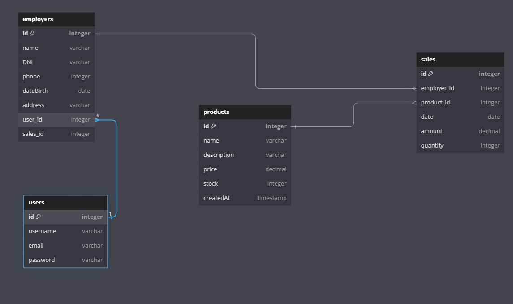

# README

## Contexto

Este proyecto está diseñado para un comercio de suministros de limpieza que requiere que cada uno de sus empleados pueda registrar sus ventas de forma individual. Además, los empleados deben tener acceso a la aplicación utilizando credenciales. 

## Estructura de Modelos

Este proyecto incluye cuatro modelos de Mongoose que representan las colecciones necesarias para la aplicación:

1. **User**: Modelo que gestiona la autenticación y la información de los usuarios.
2. **Employer**: Modelo que representa a los empleados que registran las ventas.
3. **Products**: Modelo que describe los productos disponibles en el comercio.
4. **Sales**: Modelo que registra las ventas realizadas por los empleados.

### 1. Modelo: User

```javascript
import mongoose from 'mongoose';

const userSchema = new mongoose.Schema({
  username: { type: String, required: true, unique: true },
  email: { type: String, required: true, unique: true },
  password: { type: String, required: true },
});

const User = mongoose.model('User', userSchema);

export default User;
```

- **username**: Nombre de usuario único para la autenticación.
- **email**: Correo electrónico único del usuario.
- **password**: Contraseña del usuario (debería ser almacenada de forma segura, utilizando hashing).

### 2. Modelo: Employer

```javascript
import mongoose from "mongoose";

const employerSchema = new mongoose.Schema({
    name:{
        type: String,
        required: true
    },
    DNI:{
        type: String,
        required: true,
        unique: true
    },
    phone:{
        type: Number,
        required: true
    },
    dateBirth:{
        type: Date,
        required: true
    },
    address:{
        type: String,
        required: true
    },
    user:{
        type: mongoose.Schema.Types.ObjectId,
        ref: "User",
    },
    sales:{
        type: mongoose.Schema.Types.ObjectId,
        ref: "Sales",
    }
})

const employer = mongoose.model("employer", employerSchema);

export default employer;
```

- **name**: Nombre del empleado.
- **DNI**: Documento Nacional de Identidad, único para cada empleado.
- **phone**: Número de teléfono del empleado.
- **dateBirth**: Fecha de nacimiento del empleado.
- **address**: Dirección del empleado.
- **user**: Referencia al modelo `User`, estableciendo una relación entre el empleado y su cuenta de usuario para la autenticación.
- **sales**: Referencia al modelo `Sales`, permitiendo relacionar las ventas registradas por el empleado.

### 3. Modelo: Products

```javascript
import mongoose from "mongoose";

const productsSchema = new mongoose.Schema({
    name: {
        type: String,
        required: true, 
        trim: true 
    },
    description: {
        type: String,
        trim: true 
    },
    price: {
        type: Number,
        required: true, 
        min: 0 
    },
    stock: {
        type: Number,
        required: true, 
        min: 0 
    },
    createdAt: {
        type: Date,
        default: Date.now 
    }
});

const Products = mongoose.model("Products", productsSchema);

export default Products;
```

- **name**: Nombre del producto.
- **description**: Descripción del producto.
- **price**: Precio del producto.
- **stock**: Cantidad disponible del producto.
- **createdAt**: Fecha de creación del producto.

### 4. Modelo: Sales

```javascript
import mongoose from "mongoose";

const saleSchema = new mongoose.Schema({
    employer: {
        type: mongoose.Schema.Types.ObjectId,
        ref: "employer", 
        required: true 
    },
    product: {
        type: mongoose.Schema.Types.ObjectId,
        ref: "Products", 
        required: true 
    },
    date: {
        type: Date,
        required: true, 
        default: Date.now 
    },
    amount: {
        type: Number,
        required: true, 
        min: 0 
    },
    quantity: {
        type: Number,
        required: true, 
        min: 1
    }
});

const Sales = mongoose.model("Sales", saleSchema);

export default Sales;
```

- **employer**: Referencia al modelo `Employer`, identificando al empleado a cargo de la venta.
- **product**: Referencia al modelo `Products`, identificando el producto vendido.
- **date**: Fecha de la venta.
- **amount**: Monto total de la venta.
- **quantity**: Cantidad de productos vendidos.

## Relaciones entre Modelos

- **User y Employer**: Cada `Employer` está asociado con un `User`, lo que permite la autenticación de los empleados en la aplicación.
- **Employer y Sales**: Cada `Sale` está asociado con un `Employer`, lo que permite rastrear qué empleado realizó cada venta.
- **Products y Sales**: Cada `Sale` está asociada con un `Product`, lo que permite saber qué producto fue vendido.
